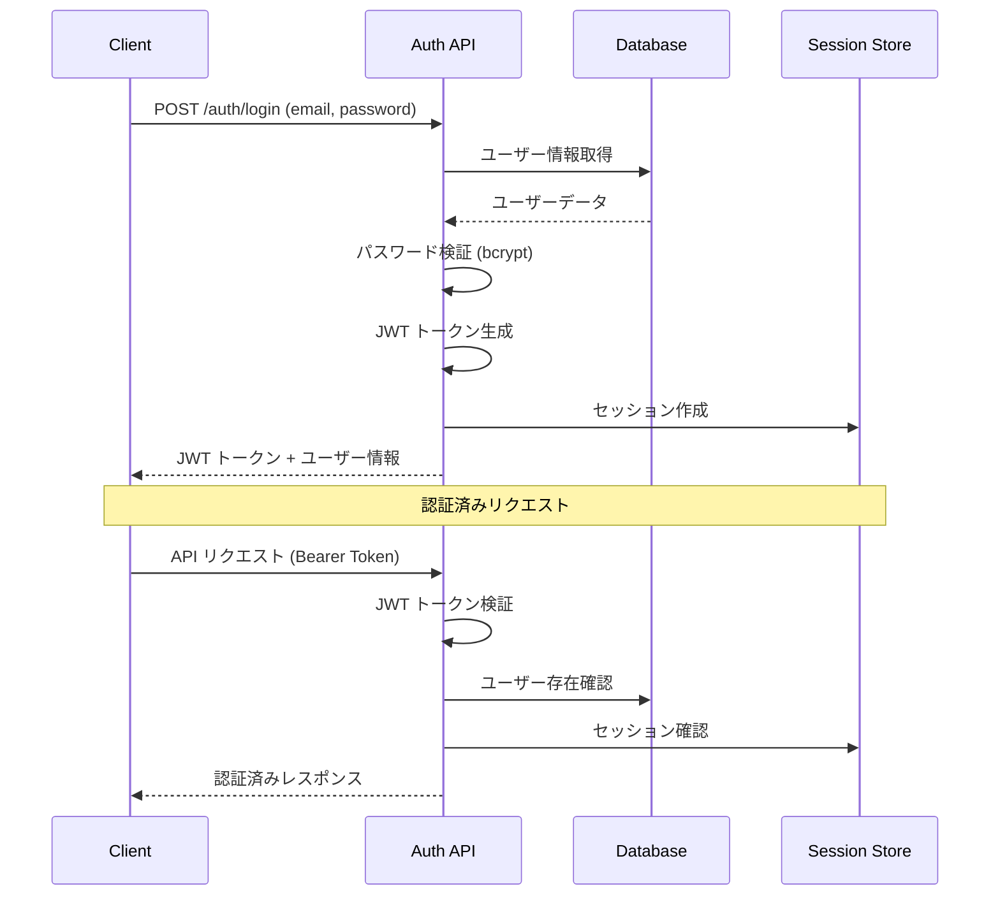

# 認証システム設計書 (Phase 2)

## 概要

Phase 2では、ユーザー管理とセキュアな認証機能を実現するため、JWT（JSON Web Token）ベースの認証システムを実装しました。本ドキュメントでは、認証アーキテクチャ、セキュリティ実装、セッション管理について詳述します。

## 認証アーキテクチャ

### 認証方式
- **プライマリ認証**: JWT Bearer Token
- **セッション管理**: データベースベースのセッション追跡
- **パスワード保護**: bcrypt ハッシュ化（12ラウンド）
- **トークン有効期限**: 24時間

### 認証フロー



## JWT実装詳細

### トークン構造
```json
{
  "header": {
    "alg": "HS256",
    "typ": "JWT"
  },
  "payload": {
    "userId": "uuid",
    "email": "user@example.com",
    "iat": 1671234567,
    "exp": 1671320967,
    "iss": "stock-analysis-helper",
    "aud": "stock-analysis-users"
  },
  "signature": "HMACSHA256(...)"
}
```

### セキュリティ設定
```typescript
const jwtConfig = {
  secret: process.env.JWT_SECRET, // 256bit以上の強力な秘密鍵
  expiresIn: '24h',
  issuer: 'stock-analysis-helper',
  audience: 'stock-analysis-users',
  algorithm: 'HS256'
};
```

### トークン生成
```typescript
generateToken(userId: string, email: string): string {
  try {
    return jwt.sign(
      { userId, email },
      this.jwtSecret,
      { 
        expiresIn: this.jwtExpiry,
        issuer: 'stock-analysis-helper',
        audience: 'stock-analysis-users'
      }
    );
  } catch (error) {
    console.error('Error generating JWT token:', error);
    throw new Error('Failed to generate authentication token');
  }
}
```

### トークン検証
```typescript
verifyToken(token: string): TokenPayload | null {
  try {
    const decoded = jwt.verify(token, this.jwtSecret, {
      issuer: 'stock-analysis-helper',
      audience: 'stock-analysis-users'
    }) as TokenPayload;
    
    return decoded;
  } catch (error) {
    if (error instanceof jwt.TokenExpiredError) {
      console.log('Token expired');
    } else if (error instanceof jwt.JsonWebTokenError) {
      console.log('Invalid token');
    }
    return null;
  }
}
```

## パスワードセキュリティ

### ハッシュ化実装
```typescript
async hashPassword(password: string): Promise<string> {
  try {
    return await bcrypt.hash(password, this.saltRounds); // 12ラウンド
  } catch (error) {
    console.error('Error hashing password:', error);
    throw new Error('Failed to hash password');
  }
}

async verifyPassword(password: string, hash: string): Promise<boolean> {
  try {
    return await bcrypt.compare(password, hash);
  } catch (error) {
    console.error('Error verifying password:', error);
    return false;
  }
}
```

### パスワード強度要件
```typescript
const passwordRequirements = {
  minLength: 8,
  requireUppercase: true,
  requireLowercase: true,
  requireNumbers: true,
  requireSpecialChars: true,
  pattern: /^(?=.*[a-z])(?=.*[A-Z])(?=.*\d)(?=.*[@$!%*?&])[A-Za-z\d@$!%*?&]/
};
```

**要件詳細**:
- 最低8文字以上
- 大文字を最低1文字
- 小文字を最低1文字
- 数字を最低1文字
- 特殊文字を最低1文字（@$!%*?&）

## セッション管理

### セッションテーブル設計
```sql
CREATE TABLE user_sessions (
    id UUID PRIMARY KEY DEFAULT gen_random_uuid(),
    user_id UUID REFERENCES users(id) ON DELETE CASCADE,
    token_hash VARCHAR(255) NOT NULL,
    expires_at TIMESTAMP WITH TIME ZONE NOT NULL,
    created_at TIMESTAMP WITH TIME ZONE DEFAULT CURRENT_TIMESTAMP,
    ip_address INET,
    user_agent TEXT,
    is_active BOOLEAN DEFAULT true
);
```

### セッション作成
```typescript
async createUserSession(
  userId: string, 
  token: string, 
  ipAddress: string, 
  userAgent: string
): Promise<boolean> {
  try {
    // トークンをハッシュ化して保存（追加セキュリティ層）
    const tokenHash = await this.hashPassword(token);
    
    const query = `
      INSERT INTO user_sessions (user_id, token_hash, expires_at, ip_address, user_agent)
      VALUES ($1, $2, $3, $4, $5)
    `;
    
    const expiresAt = new Date(Date.now() + 24 * 60 * 60 * 1000); // 24時間
    
    await db.query(query, [userId, tokenHash, expiresAt, ipAddress, userAgent]);
    return true;
  } catch (error) {
    console.error('Error creating user session:', error);
    return false;
  }
}
```

### セッション無効化
```typescript
async invalidateUserSession(userId: string, token: string): Promise<boolean> {
  try {
    const query = `
      UPDATE user_sessions 
      SET is_active = false 
      WHERE user_id = $1 AND is_active = true
    `;
    
    await db.query(query, [userId]);
    return true;
  } catch (error) {
    console.error('Error invalidating user session:', error);
    return false;
  }
}
```

### セッションクリーンアップ
```typescript
async cleanupExpiredSessions(): Promise<void> {
  try {
    const query = `
      DELETE FROM user_sessions 
      WHERE expires_at < CURRENT_TIMESTAMP OR is_active = false
    `;
    
    const result = await db.query(query);
    console.log(`Cleaned up ${result.rowCount} expired sessions`);
  } catch (error) {
    console.error('Error cleaning up expired sessions:', error);
  }
}
```

## ユーザー管理

### ユーザー登録
```typescript
async createUser(email: string, password: string, username?: string): Promise<any> {
  try {
    // メールアドレスの正規化
    const normalizedEmail = email.toLowerCase().trim();
    
    // パスワード強度チェック
    if (!this.validatePasswordStrength(password)) {
      throw new Error('Password does not meet security requirements');
    }
    
    // 既存ユーザーチェック
    const existingUser = await this.getUserByEmail(normalizedEmail);
    if (existingUser) {
      throw new Error('User already exists');
    }
    
    const hashedPassword = await this.hashPassword(password);
    
    const query = `
      INSERT INTO users (email, password_hash, username)
      VALUES ($1, $2, $3)
      RETURNING id, email, username, created_at
    `;
    
    const result = await db.query(query, [normalizedEmail, hashedPassword, username]);
    return result.rows[0];
  } catch (error) {
    console.error('Error creating user:', error);
    throw error;
  }
}
```

### ユーザー認証
```typescript
async authenticateUser(email: string, password: string): Promise<any> {
  try {
    const user = await this.getUserByEmail(email);
    
    if (!user) {
      // セキュリティのため、ユーザーが存在しないことを明かさない
      await this.handleFailedLogin(email);
      throw new Error('Invalid credentials');
    }
    
    // アカウント状態チェック
    if (!user.is_active) {
      throw new Error('Account is deactivated');
    }
    
    // アカウントロック状態チェック
    if (user.locked_until && new Date(user.locked_until) > new Date()) {
      throw new Error('Account is temporarily locked');
    }
    
    // パスワード検証
    const passwordValid = await this.verifyPassword(password, user.password_hash);
    
    if (!passwordValid) {
      await this.handleFailedLogin(email);
      throw new Error('Invalid credentials');
    }
    
    // ログイン成功処理
    await this.updateLastLogin(user.id);
    
    return {
      id: user.id,
      email: user.email,
      username: user.username
    };
  } catch (error) {
    console.error('Authentication error:', error);
    throw error;
  }
}
```

## セキュリティ機能

### ログイン試行制限
```typescript
async handleFailedLogin(email: string): Promise<void> {
  try {
    const query = `
      UPDATE users 
      SET 
        failed_login_attempts = failed_login_attempts + 1,
        locked_until = CASE 
          WHEN failed_login_attempts >= 4 THEN CURRENT_TIMESTAMP + INTERVAL '30 minutes'
          ELSE locked_until
        END
      WHERE email = $1
    `;
    
    await db.query(query, [email.toLowerCase()]);
  } catch (error) {
    console.error('Error handling failed login:', error);
  }
}
```

**アカウントロック仕様**:
- 5回連続ログイン失敗でアカウントロック
- ロック期間: 30分間
- 成功ログイン時に試行回数リセット

### 認証ミドルウェア
```typescript
export const authenticateToken = async (
  req: AuthenticatedRequest, 
  res: Response, 
  next: NextFunction
) => {
  try {
    const authHeader = req.headers['authorization'];
    const token = authHeader && authHeader.split(' ')[1]; // Bearer TOKEN

    if (!token) {
      return res.status(401).json({ 
        success: false, 
        error: 'Access token required',
        timestamp: new Date().toISOString()
      });
    }

    const decoded = authService.verifyToken(token);
    
    if (!decoded) {
      return res.status(403).json({ 
        success: false, 
        error: 'Invalid or expired token',
        timestamp: new Date().toISOString()
      });
    }

    // ユーザー存在・状態確認
    const user = await authService.getUserByEmail(decoded.email);
    
    if (!user || !user.is_active) {
      return res.status(403).json({ 
        success: false, 
        error: 'User account not found or inactive',
        timestamp: new Date().toISOString()
      });
    }

    // アカウントロック確認
    if (user.locked_until && new Date(user.locked_until) > new Date()) {
      return res.status(423).json({ 
        success: false, 
        error: 'Account temporarily locked',
        timestamp: new Date().toISOString()
      });
    }

    req.user = {
      id: user.id,
      email: user.email,
      username: user.username
    };

    next();
  } catch (error) {
    console.error('Authentication middleware error:', error);
    return res.status(500).json({ 
      success: false, 
      error: 'Authentication service error',
      timestamp: new Date().toISOString()
    });
  }
};
```

### レート制限
```typescript
export const authLimiter = rateLimit({
  windowMs: 15 * 60 * 1000, // 15分間
  max: 5, // 5回の認証試行
  message: {
    success: false,
    error: 'Too many authentication attempts. Please try again later.',
    timestamp: new Date().toISOString()
  },
  standardHeaders: true,
  legacyHeaders: false,
  skipSuccessfulRequests: true // 成功したリクエストはカウントしない
});

export const loginLimiter = rateLimit({
  windowMs: 15 * 60 * 1000, // 15分間
  max: 10, // 10回のログイン試行
  message: {
    success: false,
    error: 'Too many login attempts. Please try again later.',
    timestamp: new Date().toISOString()
  },
  standardHeaders: true,
  legacyHeaders: false,
  skipSuccessfulRequests: true
});
```

## API エンドポイント実装

### ユーザー登録エンドポイント
```typescript
router.post('/register', async (req: Request, res: Response) => {
  try {
    const { email, password, username } = req.body;

    // 入力検証
    if (!email || !password) {
      return res.status(400).json(
        createSecureApiResponse(false, undefined, 'Email and password are required')
      );
    }

    // メール形式検証
    const emailRegex = /^[a-zA-Z0-9._%+-]+@[a-zA-Z0-9.-]+\.[a-zA-Z]{2,}$/;
    if (!emailRegex.test(email)) {
      return res.status(400).json(
        createSecureApiResponse(false, undefined, 'Invalid email format')
      );
    }

    // パスワード強度検証
    if (!validatePasswordStrength(password)) {
      return res.status(400).json(
        createSecureApiResponse(false, undefined, 'Password does not meet security requirements')
      );
    }

    // ユーザー作成
    const newUser = await authService.createUser(email, password, username);
    
    // JWT生成
    const token = authService.generateToken(newUser.id, newUser.email);
    
    // セッション作成
    await authService.createUserSession(
      newUser.id, 
      token, 
      req.ip || 'unknown',
      req.get('User-Agent') || 'unknown'
    );

    res.status(201).json(createSecureApiResponse(true, {
      user: {
        id: newUser.id,
        email: newUser.email,
        username: newUser.username,
        createdAt: newUser.created_at
      },
      token,
      message: 'User registered successfully'
    }));

  } catch (error) {
    console.error('Registration error:', error);
    
    if (error instanceof Error && error.message.includes('already exists')) {
      return res.status(409).json(
        createSecureApiResponse(false, undefined, 'User with this email already exists')
      );
    }
    
    res.status(500).json(
      createSecureApiResponse(false, undefined, 'Registration failed')
    );
  }
});
```

### ログインエンドポイント
```typescript
router.post('/login', loginLimiter, async (req: Request, res: Response) => {
  try {
    const { email, password } = req.body;

    if (!email || !password) {
      return res.status(400).json(
        createSecureApiResponse(false, undefined, 'Email and password are required')
      );
    }

    // ユーザー認証
    const user = await authService.authenticateUser(email, password);
    
    // JWT生成
    const token = authService.generateToken(user.id, user.email);
    
    // セッション作成
    await authService.createUserSession(
      user.id, 
      token, 
      req.ip || 'unknown',
      req.get('User-Agent') || 'unknown'
    );

    res.json(createSecureApiResponse(true, {
      user: {
        id: user.id,
        email: user.email,
        username: user.username,
        lastLogin: new Date().toISOString()
      },
      token,
      message: 'Login successful'
    }));

  } catch (error) {
    console.error('Login error:', error);
    
    if (error instanceof Error) {
      if (error.message.includes('Invalid credentials')) {
        return res.status(401).json(
          createSecureApiResponse(false, undefined, 'Invalid email or password')
        );
      }
      if (error.message.includes('locked')) {
        return res.status(423).json(
          createSecureApiResponse(false, undefined, 'Account temporarily locked')
        );
      }
      if (error.message.includes('deactivated')) {
        return res.status(403).json(
          createSecureApiResponse(false, undefined, 'Account is deactivated')
        );
      }
    }
    
    res.status(500).json(
      createSecureApiResponse(false, undefined, 'Login failed')
    );
  }
});
```

## セキュリティ最適化

### 環境変数設定
```bash
# 必須セキュリティ設定
JWT_SECRET=your-super-secure-256-bit-secret-key-change-this-in-production
JWT_EXPIRY=24h
BCRYPT_SALT_ROUNDS=12

# 本番環境用追加設定
NODE_ENV=production
SESSION_TIMEOUT=86400000  # 24時間（ミリ秒）
MAX_LOGIN_ATTEMPTS=5
ACCOUNT_LOCK_DURATION=1800000  # 30分（ミリ秒）
```

### トークン無効化（ログアウト）
```typescript
router.post('/logout', async (req: AuthenticatedRequest, res: Response) => {
  try {
    const authHeader = req.headers['authorization'];
    const token = authHeader && authHeader.split(' ')[1];

    if (token && req.user) {
      await authService.invalidateUserSession(req.user.id, token);
    }

    res.json(createSecureApiResponse(true, {
      message: 'Logout successful'
    }));

  } catch (error) {
    console.error('Logout error:', error);
    res.status(500).json(
      createSecureApiResponse(false, undefined, 'Logout failed')
    );
  }
});
```

### パスワード変更
```typescript
router.post('/change-password', async (req: AuthenticatedRequest, res: Response) => {
  try {
    const { currentPassword, newPassword } = req.body;

    if (!currentPassword || !newPassword) {
      return res.status(400).json(
        createSecureApiResponse(false, undefined, 'Current and new password required')
      );
    }

    // パスワード強度検証
    if (!validatePasswordStrength(newPassword)) {
      return res.status(400).json(
        createSecureApiResponse(false, undefined, 'New password does not meet security requirements')
      );
    }

    const user = await authService.getUserByEmail(req.user!.email);
    
    // 現在のパスワード確認
    const currentPasswordValid = await authService.verifyPassword(
      currentPassword, 
      user.password_hash
    );
    
    if (!currentPasswordValid) {
      return res.status(401).json(
        createSecureApiResponse(false, undefined, 'Current password is incorrect')
      );
    }

    // 新しいパスワードでハッシュ化・更新
    const newPasswordHash = await authService.hashPassword(newPassword);
    
    const updateQuery = `
      UPDATE users 
      SET password_hash = $1, updated_at = CURRENT_TIMESTAMP
      WHERE id = $2
    `;
    
    await db.query(updateQuery, [newPasswordHash, user.id]);

    // セキュリティのため全セッション無効化
    await authService.invalidateUserSession(user.id, '');

    res.json(createSecureApiResponse(true, {
      message: 'Password changed successfully. Please log in again.'
    }));

  } catch (error) {
    console.error('Change password error:', error);
    res.status(500).json(
      createSecureApiResponse(false, undefined, 'Password change failed')
    );
  }
});
```

## 監査とログ

### セキュリティイベントログ
```typescript
interface SecurityEvent {
  userId?: string;
  email?: string;
  eventType: 'LOGIN_SUCCESS' | 'LOGIN_FAILED' | 'LOGOUT' | 'PASSWORD_CHANGE' | 'ACCOUNT_LOCKED';
  ipAddress: string;
  userAgent: string;
  timestamp: Date;
  metadata?: Record<string, any>;
}

class SecurityLogger {
  async logEvent(event: SecurityEvent): Promise<void> {
    try {
      console.log(`[SECURITY] ${event.eventType}:`, {
        userId: event.userId,
        email: event.email?.substring(0, 3) + '***', // プライバシー保護
        ipAddress: event.ipAddress,
        timestamp: event.timestamp,
        metadata: event.metadata
      });
      
      // 本番環境では専用ログファイルまたはログサービスに送信
    } catch (error) {
      console.error('Failed to log security event:', error);
    }
  }
}
```

## パフォーマンス考慮事項

### データベース最適化
- ユーザーテーブルのemailカラムにインデックス
- セッションテーブルの期限切れセッション定期削除
- パスワードハッシュ化のソルトラウンド最適化（12ラウンド）

### メモリ使用量
- JWTペイロードのサイズ最小化
- セッション情報のキャッシュ化検討
- 期限切れトークンの適切な処理

## 今後の拡張計画

### Phase 3 での認証機能拡張
1. **Multi-Factor Authentication (MFA)**
   - TOTP（Time-based One-Time Password）
   - SMS認証
   - メール認証

2. **OAuth統合**
   - Google OAuth
   - GitHub OAuth
   - Apple OAuth

3. **セキュリティ強化**
   - デバイス記憶機能
   - 異常ログイン検知
   - IP地域制限

4. **管理機能**
   - ユーザー管理ダッシュボード
   - セキュリティ監査ログ
   - 権限管理システム

この包括的な認証システムにより、セキュアで拡張性の高いユーザー管理基盤を提供し、Phase 3での更なる機能拡張にも対応可能です。